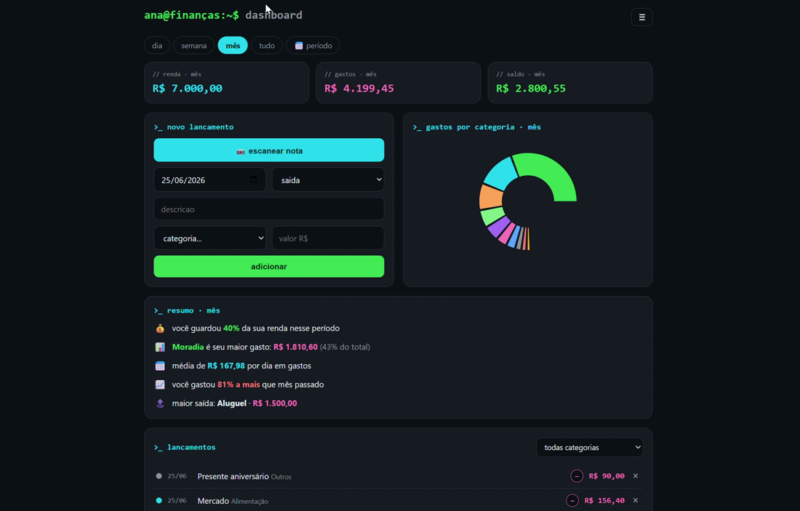

# 💸 finanças — dashboard de finanças pessoais com leitura de nota por IA


> **finanças** é um app de finanças pessoais (web + mobile) que controla entradas, gastos e saldo — com o diferencial de **lançar um gasto só tirando foto da nota fiscal**: a IA lê os itens, valores e categorias, você confere e confirma. Projeto pessoal, 100% gratuito.

🔗 **Acesse:** https://financas-app-ruby.vercel.app



---

## 📌 Sumário

- [Visão Geral](#-visão-geral)
- [Funcionalidades](#-funcionalidades)
- [Arquitetura](#-arquitetura)
- [Fluxo da Leitura da Nota](#-fluxo-da-leitura-da-nota)
- [Estrutura do Projeto](#-estrutura-do-projeto)
- [Banco de Dados](#-banco-de-dados)
- [Configuração e Variáveis de Ambiente](#-configuração-e-variáveis-de-ambiente)
- [Deploy](#-deploy)
- [Segurança](#-segurança)
- [Status Atual](#-status-atual)
- [Roadmap](#-roadmap)
- [Débitos Técnicos Mapeados](#-débitos-técnicos-mapeados)
- [Como Executar Localmente](#-como-executar-localmente)
- [Autoria](#-autoria)

---

## 🚀 Visão Geral

O **finanças** é uma SPA construída em **React + TypeScript + Vite**, com **Supabase** no backend (Postgres, Auth e Row Level Security), uma **Edge Function** em Deno que chama o **Google Gemini** para ler a nota fiscal, e deploy automático na **Vercel**.

Surgiu de uma dor própria: controlar gastos sem ter que digitar tudo na mão. A ideia central é tirar uma foto da nota e deixar a IA fazer o trabalho chato.

Princípios do projeto:

- **Lógica separada da UI:** o cálculo financeiro vive em funções puras (`lib/finance.ts`), os dados num hook (`hooks/useFinanceData.ts`) e a tela em componentes pequenos — nada de _god component_.
- **Segurança por padrão:** cada usuário só enxerga os próprios dados (RLS no Postgres). Segredos de verdade (Gemini) ficam no servidor, nunca no front.
- **Revisar antes de salvar:** a IA sugere, mas quem confirma é a pessoa — o scan abre um modal de revisão editável.
- **Grátis de ponta a ponta:** todo o stack roda em planos gratuitos.

---

## 🧩 Funcionalidades

| Funcionalidade | Descrição | Status |
|---|---|---|
| 📷 Scan de nota fiscal | Foto → a IA extrai itens, valores, data e categoria → modal de revisão → lançado | No ar |
| ✍️ Lançamento manual + edição inline | Adicionar pelo formulário e **editar clicando direto** no nome/categoria/valor/data/tipo | No ar |
| 🏷️ Filtros | Por período (dia/semana/mês/tudo), por categoria e **calendário de intervalo personalizado** | No ar |
| 📊 Resumo com insights | Taxa de poupança, maior categoria, média diária e **comparação com o período anterior** | No ar |
| 🥧 Gráfico por categoria | Pizza dos gastos do período | No ar |
| 🌗 Tema e perfil | Claro / escuro / sistema + profissão e hobbies | No ar |
| ⬇️ Exportar CSV | Baixa os lançamentos no formato que o Excel-BR abre certinho | No ar |
| 🔐 Multiusuário isolado | Login por e-mail/senha; cada conta só vê os próprios dados (RLS) | No ar |

---

## 🏗️ Arquitetura

```text
Usuário (navegador / celular)
    ↓
React + Vite (SPA)
    │
    ├── components/   UI  (dashboard quebrado em peças: TopBar, Kpis, EntryForm, CategoryChart, Summary…)
    ├── hooks/        estado + efeitos  (useFinanceData, useDismissable)
    └── lib/          lógica pura + serviços  (finance, scan, format, supabase, theme)
    ↓
Supabase
    ├── Auth                         (e-mail/senha)
    ├── Postgres + Row Level Security (categories, transactions, profiles, receipts)
    └── Edge Function `scan-receipt` (Deno) ──→ Google Gemini (visão lê a nota)
    ↓
Vercel  (deploy automático a cada push na main)
```

A separação em camadas é o coração da refatoração: **`lib/` não conhece React** (é testável isolado), **`hooks/` cuida do estado e do Supabase**, e **`components/` só desenha**. O `Dashboard.tsx` é um orquestrador enxuto que junta as três camadas.

---

## 🔄 Fluxo da Leitura da Nota

```text
1. Usuário tira/escolhe a foto da nota   (EntryForm)
2. fileToBase64                          (lib/format)
3. supabase.functions.invoke('scan-receipt')   →  Edge Function (Deno)
4. Edge Function chama o Gemini com responseSchema  →  JSON estruturado { merchant, date, items[] }
5. lib/scan transforma em linhas editáveis (ReviewRow[])
6. ScanReview: usuário confere/edita/remove e confirma
7. insertScanned → INSERT em transactions (source: 'foto')  →  dashboard recalcula
```

A IA **sugere**; o lançamento só entra depois da revisão. A chave do Gemini fica num **secret do Supabase** e é usada apenas server-side, dentro da Edge Function — nunca chega ao navegador.

---

## 📁 Estrutura do Projeto

```text
financas-app/
│
├── src/
│   ├── lib/                       # utils puros, clientes e lógica de negócio (sem React)
│   │   ├── supabase.ts            (cliente Supabase; URL/anon com fallback p/ deploy)
│   │   ├── finance.ts             (análise PURA: filtro por período, totais, pizza, insights)
│   │   ├── scan.ts                (serviço de leitura da nota via Edge Function/Gemini)
│   │   ├── format.ts              (brl, datas, fileToBase64)
│   │   ├── theme.ts               (tema claro/escuro/sistema)
│   │   └── constants.ts           (OWNER_ID, cores)
│   │
│   ├── hooks/
│   │   ├── useFinanceData.ts      (carrega categorias/transações/perfil + operações de escrita)
│   │   └── useDismissable.ts      (fecha popover ao clicar fora ou apertar Esc)
│   │
│   ├── components/
│   │   ├── dashboard/             # o dashboard, quebrado em peças focadas
│   │   │   ├── Dashboard.tsx       (orquestrador — junta dados + UI)
│   │   │   ├── TopBar.tsx          (marca, bio e menu)
│   │   │   ├── PeriodFilter.tsx    (chips de período + calendário de intervalo)
│   │   │   ├── Kpis.tsx            (renda / gastos / saldo)
│   │   │   ├── EntryForm.tsx       (novo lançamento + escanear nota)
│   │   │   ├── CategoryChart.tsx   (pizza por categoria)
│   │   │   ├── Summary.tsx         (insights do período)
│   │   │   ├── TransactionsCard.tsx (lista + filtro + "ver mais")
│   │   │   └── Welcome.tsx         (onboarding de quem entra sem dados)
│   │   ├── Login.tsx              (entrar / cadastrar)
│   │   ├── ScanReview.tsx         (modal de revisão da nota escaneada)
│   │   ├── TxList.tsx             (lista com edição inline)
│   │   ├── TxModal.tsx            (popup "todos os lançamentos")
│   │   ├── Settings.tsx           (tema + perfil)
│   │   ├── Account.tsx            (dados da conta + troca de senha)
│   │   ├── About.tsx              (sobre — versão dona / versão produto)
│   │   ├── RangeCalendar.tsx      (seleção de intervalo de datas)
│   │   └── ScrollTopButton.tsx    (voltar ao topo — só no mobile)
│   │
│   ├── types.ts                   # Category, Transaction, Profile, ReviewRow, TxPatch
│   ├── App.tsx                    (gate de autenticação: Login ou Dashboard)
│   ├── main.tsx                   (entrada; aplica o tema salvo no boot)
│   └── index.css                  (tema dark/neon + paleta clara via variáveis CSS)
│
├── supabase/functions/scan-receipt/
│   └── index.ts                   (Edge Function Deno — chama o Gemini; chave no secret)
│
├── docs/dashboard.png             (print usado no README)
├── .env.example                   (referência das variáveis; .env fica fora do git)
└── vite.config.ts
```

---

## 🗄️ Banco de Dados

Quatro tabelas no Postgres, **todas com Row Level Security** (`auth.uid() = user_id`) — cada conta só lê/escreve as próprias linhas:

| Tabela | Conteúdo |
|---|---|
| `categories` | Categorias do usuário (nome, cor, tipo); 12 padrões criadas no cadastro via _trigger_ |
| `transactions` | Lançamentos (data, tipo, descrição, valor, categoria, origem manual/foto) |
| `profiles` | Perfil (profissão, hobbies, tema) |
| `receipts` | Notas escaneadas |

Valores monetários são `numeric(12,2)` (nunca float). O `user_id` tem `default auth.uid()`, então o cliente nunca precisa enviá-lo. A função de seed roda como `SECURITY DEFINER` com `execute` revogado de `public/anon/authenticated`.

---

## ⚙️ Configuração e Variáveis de Ambiente

O front lê a URL e a chave **anon** do Supabase via Vite. O `.env` fica **fora do git** (`.env.example` documenta o schema). A chave anon é pública por design — quem protege os dados é o RLS — e tem _fallback_ no código para o deploy funcionar mesmo sem env vars.

```bash
# .env (a partir do .env.example)
VITE_SUPABASE_URL=https://SEU_PROJETO.supabase.co
VITE_SUPABASE_ANON_KEY=SUA_CHAVE_ANON
```

| Chave | Onde | Descrição | Secreto |
|---|---|---|:--:|
| `VITE_SUPABASE_URL` | front (.env / Vercel) | URL do projeto Supabase | |
| `VITE_SUPABASE_ANON_KEY` | front (.env / Vercel) | Chave anon (pública; RLS protege os dados) | |
| `GEMINI_API_KEY` | **secret do Supabase** | Chave do Google Gemini, usada só na Edge Function | 🔑 |
| `GEMINI_MODEL` | secret do Supabase (opcional) | Modelo do Gemini (padrão `gemini-flash-lite-latest`) | |

> 🔐 A chave do Gemini **nunca** vai ao navegador: ela é lida via `Deno.env` dentro da Edge Function `scan-receipt`.

---

## ☁️ Deploy

**CI/CD na Vercel:** todo `push` na branch `main` republica o app automaticamente (build `tsc -b && vite build`). Não há deploy manual no fluxo normal.

- **Front:** Vercel (`financas-app-ruby.vercel.app`)
- **Backend:** Supabase (Postgres + Auth + Edge Functions)
- **Edge Function:** `supabase functions deploy scan-receipt` (com `GEMINI_API_KEY` setada nos secrets do projeto)

---

## 🔒 Segurança

### Boas práticas aplicadas

- **Row Level Security** em todas as tabelas — isolamento total entre usuários.
- Chave do **Gemini só no servidor** (secret do Supabase + Edge Function); nunca no bundle do cliente.
- Chave **anon é pública por natureza** (vai no bundle de qualquer app Supabase) — segura porque o RLS é a real barreira.
- `.env` no `.gitignore`; `.env.example` documenta sem expor segredos.
- Repositório auditado antes de abrir (sem segredos no código ou no histórico).

### Recomendações

- Não logar conteúdo sensível de notas/recibos.
- Avaliar rate limit no scan para proteger a franquia gratuita do Gemini.
- Confirmação de e-mail no cadastro caso o app deixe de ser só demo.

---

## 📌 Status Atual

```text
✅ No ar em produção (Vercel) e em uso no celular, com usuários reais
✅ Scan de nota fiscal por IA (Gemini via Edge Function, com revisão antes de salvar)
✅ Auth e-mail/senha + dados isolados por RLS
✅ Filtros (período / categoria / calendário de intervalo)
✅ Edição inline dos lançamentos + insights + exportar CSV
✅ Tema claro/escuro/sistema + perfil (profissão e hobbies)
✅ Deploy automático na main (Vercel)
✅ Arquitetura em camadas (lib / hooks / components) — sem god-component
⚠️ Sem testes automatizados (o "gate" é só o build)
```

---

## 🗺️ Roadmap

### Curto prazo

- [ ] PWA — instalar na tela inicial (manifest + service worker)
- [ ] Desfazer / confirmar ao excluir um lançamento
- [ ] Trocar `alert()` por toasts discretos

### Médio prazo

- [ ] Orçamento / metas por categoria (com barra de progresso)
- [ ] Gráfico de evolução mês a mês
- [ ] Testes automatizados (Vitest) sobre `lib/finance`

### Longo prazo

- [ ] Leitura de QR Code da NFC-e (dados estruturados da SEFAZ)
- [ ] Recorrências (lançamentos fixos automáticos)

---

## 🧾 Débitos Técnicos Mapeados

| Item | Impacto | Prioridade |
|---|---|---|
| Sem testes automatizados | Regressão de comportamento não é pega no build | Média |
| `alert()` nativo para erros | UX abrupta em falhas | Baixa |
| Bundle único > 500 kB (recharts) | Carregamento inicial maior; cabe code-splitting | Baixa |

---

## 🧪 Como Executar Localmente

```bash
npm install
cp .env.example .env   # preencha VITE_SUPABASE_URL e VITE_SUPABASE_ANON_KEY
npm run dev            # http://localhost:5173
npm run build          # build de produção (tsc -b && vite build)
```

A leitura de nota depende da Edge Function `supabase/functions/scan-receipt` com a `GEMINI_API_KEY` configurada nos secrets do Supabase.

---

## 👩‍💻 Autoria

Desenvolvido por **Ana Neves**.

Projeto pessoal de finanças, criado para resolver uma dor própria e como estudo prático de full-stack: autenticação, banco com RLS, integração com IA, edge functions e deploy contínuo.
