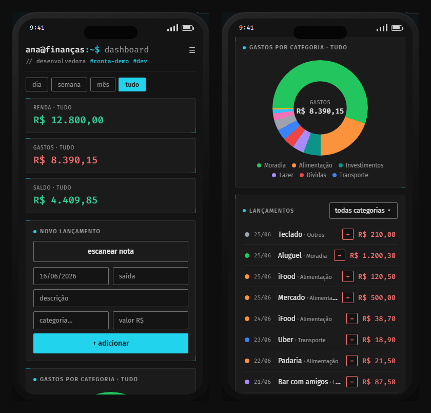

# 💸 AlienFinanças — finanças pessoais no estilo cockpit, com leitura de nota por IA


> **AlienFinanças** é um app de finanças pessoais (web + celular, instalável) que controla entradas, gastos, saldo e metas — com o diferencial de **lançar um gasto só tirando foto da nota fiscal**: a IA lê o total, você confere e confirma. A interface é um **painel de instrumentos** ("cockpit"): módulos com cantoneiras, rótulos de seção com ponto de status, números em fonte mono e um acento escolhível. Projeto pessoal, 100% gratuito.

🔗 **Acesse:** https://financas-app-ruby.vercel.app · 🎬 **Tour interativo:** https://financas-app-ruby.vercel.app/tour.html



---

## 📌 Sumário

- [Visão Geral](#-visão-geral)
- [Funcionalidades](#-funcionalidades)
- [Design System](#-design-system)
- [Arquitetura](#-arquitetura)
- [Fluxo da Leitura da Nota](#-fluxo-da-leitura-da-nota)
- [Metas como Instrumento](#-metas-como-instrumento)
- [Estrutura do Projeto](#-estrutura-do-projeto)
- [Banco de Dados](#-banco-de-dados)
- [Configuração e Variáveis de Ambiente](#-configuração-e-variáveis-de-ambiente)
- [Deploy e Operação](#-deploy-e-operação)
- [Segurança](#-segurança)
- [Testes](#-testes)
- [Status Atual](#-status-atual)
- [Roadmap](#-roadmap)
- [Débitos Técnicos Mapeados](#-débitos-técnicos-mapeados)
- [Como Executar Localmente](#-como-executar-localmente)
- [Autoria](#-autoria)

---

## 🚀 Visão Geral

O **AlienFinanças** é uma SPA em **React + TypeScript + Vite**, com **Supabase** no backend (Postgres, Auth, Row Level Security e uma função transacional), uma **Edge Function** em Deno que chama o **Google Gemini** para ler a nota fiscal, **PWA** instalável com fontes em cache para uso offline, e deploy automático na **Vercel**.

Surgiu de uma dor própria: controlar gastos sem digitar tudo na mão. A ideia central é tirar uma foto da nota e deixar a IA fazer o trabalho chato — e, a partir daí, transformar o resto do app num painel que **diz o que fazer**, não só o que aconteceu.

Princípios do projeto:

- **Lógica separada da UI:** o cálculo financeiro vive em funções puras (`lib/finance.ts`, testadas com Vitest), os dados num hook (`hooks/useFinanceData.ts`) e a tela em componentes pequenos — nada de _god component_.
- **Segurança por padrão:** cada usuário só enxerga os próprios dados (RLS no Postgres). Segredos de verdade (Gemini) ficam no servidor, nunca no front.
- **Revisar antes de salvar:** a IA sugere, mas quem confirma é a pessoa.
- **Acessível de fato:** todos os pares de cor foram calculados (texto ≥ 4,5:1, controles ≥ 3:1) nos dois temas; cor nunca é a única codificação.
- **Grátis de ponta a ponta:** todo o stack roda em planos gratuitos.

---

## 🧩 Funcionalidades

| Funcionalidade | Descrição | Status |
|---|---|---|
| 📷 Scan de nota fiscal | Foto → a IA lê o **total final** (não os itens) → revisão editável → lançado | No ar |
| ✍️ Lançamento manual + edição inline | Formulário com prévia dos centavos; **editar clicando direto** no nome/categoria/valor/data/tipo | No ar |
| 🔁 Contas fixas | Qualquer lançamento vira recorrente num toque; gera o do mês sozinho; edição sincronizada nos dois sentidos | No ar |
| 🎯 Metas como instrumento | Teto do mês e por categoria, com sugestão pela média, **ritmo / projeção**, aderência dos últimos meses e avisos discretos | No ar |
| 🏷️ Filtros | Por período (dia/semana/mês/tudo), por categoria e **calendário de intervalo** | No ar |
| 📊 Resumo com insights | Taxa de poupança, maior categoria, média diária e comparação com o período anterior | No ar |
| 📈 Gráficos | Pizza, barras, colunas, **evolução no tempo** e ranking — com as cores das categorias | No ar |
| 📝 Anotações + 🧮 calculadora | Atalhos num botão flutuante "+" (desligável) | No ar |
| 🎨 Personalização | Tema claro/escuro/sistema, **acento ciano · azul · verde**, ordem das seções, perfil (profissão e hobbies) | No ar |
| ↩️ Desfazer | Exclusões com "desfazer" por alguns segundos | No ar |
| ⬇️ Exportar CSV | Baixa os lançamentos no formato que o Excel-BR abre certinho | No ar |
| 📱 PWA | Instalável no celular; fontes e app em cache p/ abrir offline | No ar |
| 🔐 Multiusuário isolado | Login por e-mail/senha; cada conta só vê os próprios dados (RLS) | No ar |

---

## 🎛️ Design System

A interface segue um sistema próprio, o **cockpit** — um painel de instrumentos em vez de um dashboard genérico:

- **Superfícies neutras:** grafite com 0% de saturação no escuro (`#141414` / `#1b1b1b`) e papel neutro-quente no claro (`#f4f4f3` / `#fff`) — nada de fundo azulado.
- **Módulos com cantoneiras:** cada card, KPI e o terminal de login têm um canto de 8px no acento, calibrado a ~3:1 (a "assinatura" do painel).
- **Rótulos de seção** em caixa alta espaçada com um **ponto de status** — que muda de cor quando uma meta passa de 80% ou estoura.
- **Tipografia:** Fira Code para números e prompt, Fira Sans para o resto; raio de 2px em tudo.
- **Um acento, escolhível:** ciano (padrão), azul ou verde — aplicado como `data-accent` no `<html>`, com o restante das cores semânticas (`--ok`, `--bad`, `--warn`) ajustadas para não colidir.
- **Contraste medido, não estimado:** todos os pares foram calculados (WCAG 2.x) nos dois temas e nos três acentos; placeholders, bordas de campo e ícones interativos têm seus próprios tokens (`--line-strong`, `--on-acc`).

Os tokens vivem no topo do `src/index.css`; o tour (`public/tour.html`) reconstrói as telas com os mesmos tokens.

---

## 🏗️ Arquitetura

```text
Usuário (navegador / celular — PWA)
    ↓
React + Vite (SPA)
    │
    ├── components/   UI  (dashboard quebrado em peças: TopBar, Kpis, EntryForm, CategoryChart, BudgetCard, Summary…)
    ├── hooks/        estado + efeitos  (useFinanceData, useUndo, useDismissable, useMediaQuery)
    └── lib/          lógica pura + serviços  (finance, format, customization, scan, supabase, theme)
    ↓
Supabase
    ├── Auth                                (e-mail/senha)
    ├── Postgres + Row Level Security       (categories, transactions, budgets, recurring, notes, profiles, receipts)
    ├── Função transacional save_budgets    (metas gravadas de uma vez só — tudo entra ou nada entra)
    └── Edge Function scan-receipt (Deno) ──→ Google Gemini (visão lê a nota)
    ↓
Vercel  (deploy automático a cada push na main)  ·  GitHub Actions (ping diário p/ o banco free não hibernar)
```

**`lib/` não conhece React** (é testável isolado), **`hooks/` cuida do estado e do Supabase**, e **`components/` só desenha**. O `Dashboard.tsx` é um orquestrador enxuto que junta as três camadas.

---

## 🔄 Fluxo da Leitura da Nota

```text
1. Usuário tira/escolhe a foto da nota   (EntryForm)
2. fileToBase64                          (lib/format)
3. supabase.functions.invoke('scan-receipt')   →  Edge Function (Deno)
4. Edge Function chama o Gemini com responseSchema  →  JSON { merchant, date, items[] }
   (o prompt pede o TOTAL FINAL da compra — não itens, subtotais, impostos ou troco;
    extratos com transações separadas são a exceção)
5. lib/scan transforma em linhas editáveis (ReviewRow[])
6. ScanReview: usuário confere/edita/remove e confirma
7. insertScanned → INSERT em transactions (source: 'foto')  →  dashboard recalcula
```

A IA **sugere**; o lançamento só entra depois da revisão. A chave do Gemini fica num **secret do Supabase** e é usada apenas server-side — nunca chega ao navegador.

---

## 🎯 Metas como Instrumento

Meta não é um formulário cego. Ao definir, cada categoria mostra a **média dos meses em que o app foi usado**, o mês passado, uma **sugestão** ("usar 420") e uma mini-barra ao vivo do gasto atual contra o valor digitado. Há um **teto do mês** geral e um aviso quando as metas por categoria somam mais que ele.

No card, cada meta tem um **marcador do "hoje"** na barra (onde o gasto deveria estar se o mês fosse linear), o **restante** em reais, o **ritmo** (`com folga` · `no ritmo` · `acima do ritmo`), a **projeção** de fechamento e três pontinhos com a **aderência** dos meses anteriores. Ao passar de 80% e ao estourar, um toast discreto avisa — uma vez por mês por meta.

Toda a matemática está em `lib/finance.ts` (`computeBudgets`, `budgetHints`, `suggestLimit`) com `today` injetável — e coberta por testes.

---

## 📁 Estrutura do Projeto

```text
financas-app/
│
├── src/
│   ├── lib/                       # utils puros, clientes e lógica de negócio (sem React)
│   │   ├── finance.ts             (análise PURA: períodos, totais, gráficos, insights, METAS)
│   │   ├── finance.test.ts        (Vitest — ritmo, projeção, aderência, dicas)
│   │   ├── format.ts              (brl, dinheiro digitado, datas no fuso local)
│   │   ├── format.test.ts         (Vitest — parse/mask de dinheiro, datas)
│   │   ├── customization.ts       (ordem das seções, cursor, atalhos, ACENTO)
│   │   ├── scan.ts                (serviço de leitura da nota via Edge Function/Gemini)
│   │   ├── supabase.ts            (cliente; URL/anon com fallback p/ deploy)
│   │   ├── theme.ts               (tema claro/escuro/sistema + theme-color do sistema)
│   │   └── constants.ts           (OWNER_ID, cor de "sem categoria", flag do tour)
│   │
│   ├── hooks/
│   │   ├── useFinanceData.ts      (carrega tudo + operações de escrita; metas via RPC)
│   │   ├── useUndo.ts             (toast com "desfazer" ou só aviso)
│   │   ├── useDismissable.ts      (fecha popover ao clicar fora / Esc)
│   │   └── useMediaQuery.ts       (mobile × desktop)
│   │
│   ├── components/
│   │   ├── dashboard/             # o dashboard, quebrado em peças focadas
│   │   │   ├── Dashboard.tsx       (orquestrador — dados + UI + avisos de meta)
│   │   │   ├── TopBar.tsx · PeriodFilter.tsx · Kpis.tsx · EntryForm.tsx
│   │   │   ├── CategoryChart.tsx   (pizza / barras / colunas / linhas / ranking)
│   │   │   ├── BudgetCard.tsx      (metas: ritmo, projeção, aderência)
│   │   │   ├── Summary.tsx · TransactionsCard.tsx · Welcome.tsx
│   │   ├── Login.tsx              (terminal: entrar / cadastrar)
│   │   ├── BudgetModal.tsx        (definir metas com contexto do histórico)
│   │   ├── RecurringModal.tsx     (contas fixas)
│   │   ├── NotesModal.tsx · Calculator.tsx · QuickActions.tsx
│   │   ├── ScanReview.tsx · TxList.tsx · TxModal.tsx
│   │   ├── Settings.tsx · Customize.tsx · Account.tsx · About.tsx
│   │   ├── RangeCalendar.tsx · Toast.tsx · ScrollTopButton.tsx · Icon.tsx
│   │
│   ├── types.ts · App.tsx · main.tsx
│   └── index.css                  (design system cockpit: tokens, acentos, componentes)
│
├── public/tour.html               (tour interativo / onboarding — mesmos tokens do app)
├── supabase/
│   ├── functions/scan-receipt/    (Edge Function Deno — chama o Gemini; chave no secret)
│   └── migrations/                (paleta de categorias, teto do mês, save_budgets)
├── scripts/gen-icons.mjs          (ícones do PWA a partir de SVG, via sharp)
├── .github/workflows/keep-awake.yml (ping diário: o Postgres free não hiberna)
├── docs/dashboard.png             (print usado no README)
├── .env.example                   (referência das variáveis; .env fica fora do git)
└── vite.config.ts                 (PWA: manifest, precache, fontes em cache)
```

---

## 🗄️ Banco de Dados

Sete tabelas no Postgres, **todas com Row Level Security** (`auth.uid() = user_id`):

| Tabela | Conteúdo |
|---|---|
| `categories` | Categorias do usuário (nome, cor, tipo); 12 padrões criadas no cadastro via _trigger_, com paleta de 11 matizes espaçados + cinza |
| `transactions` | Lançamentos (data, tipo, descrição, valor, categoria, origem manual/foto/recorrente) |
| `budgets` | Metas mensais por categoria; a linha **sem categoria** é o teto do mês (`UNIQUE NULLS NOT DISTINCT`) |
| `recurring` | Contas fixas (dia do mês, último mês gerado) |
| `notes` | Anotações livres |
| `profiles` | Perfil (profissão, hobbies, tema) |
| `receipts` | Notas escaneadas |

Valores monetários são `numeric(12,2)` (nunca float). O `user_id` tem `default auth.uid()`. A função de seed roda como `SECURITY DEFINER` com `execute` revogado de `public/anon/authenticated`; a função `save_budgets` roda como `SECURITY INVOKER` — sob o RLS do próprio usuário — e só aceita categorias que pertencem a ele. As migrações estão versionadas em `supabase/migrations/`.

---

## ⚙️ Configuração e Variáveis de Ambiente

O front lê a URL e a chave **anon** do Supabase via Vite. O `.env` fica **fora do git** (`.env.example` documenta o schema). A chave anon é pública por design — quem protege os dados é o RLS — e tem _fallback_ no código para o deploy funcionar mesmo sem env vars.

```bash
# .env (a partir do .env.example)
VITE_SUPABASE_URL=https://SEU_PROJETO.supabase.co
VITE_SUPABASE_ANON_KEY=SUA_CHAVE_ANON
```

| Chave | Onde | Descrição | Secreto |
|---|---|---|:--:|
| `VITE_SUPABASE_URL` | front (.env / Vercel) | URL do projeto Supabase | |
| `VITE_SUPABASE_ANON_KEY` | front (.env / Vercel) | Chave anon (pública; RLS protege os dados) | |
| `GEMINI_API_KEY` | **secret do Supabase** | Chave do Google Gemini, usada só na Edge Function | 🔑 |
| `GEMINI_MODEL` | secret do Supabase (opcional) | Modelo do Gemini (padrão `gemini-flash-lite-latest`) | |

---

## ☁️ Deploy e Operação

- **Front:** Vercel — todo `push` na `main` republica o app (build `tsc -b && vite build`). Branches ganham preview.
- **Backend:** Supabase (Postgres + Auth + Edge Functions). Edge Function: `supabase functions deploy scan-receipt`.
- **Banco free não hiberna:** o workflow `keep-awake.yml` faz uma request diária na API; sem isso o projeto pausa após ~7 dias sem uso e o app mostra "failed to fetch".
- **PWA:** `vite-plugin-pwa` com precache do app e cache em runtime das fontes do Google; a cor da barra do sistema acompanha o tema.

---

## 🔒 Segurança

- **Row Level Security** em todas as tabelas — isolamento total entre usuários.
- Chave do **Gemini só no servidor** (secret do Supabase + Edge Function); nunca no bundle do cliente.
- Chave **anon é pública por natureza** — segura porque o RLS é a real barreira.
- Função de seed `SECURITY DEFINER` com `execute` revogado; `save_budgets` como `SECURITY INVOKER` (sob RLS) e checagem de posse da categoria.
- `.env` no `.gitignore`; repositório auditado antes de abrir (sem segredos no código ou no histórico).

---

## 🧪 Testes

```bash
npm test        # vitest run
```

A lógica pura de `lib/` é coberta por testes: matemática das metas (ritmo, projeção, aderência com o limite atual, média só dos meses com uso, sugestão), meses/dias (virada de ano, fevereiro bissexto) e dinheiro digitado (`1.234,56`, `1.234`, negativos). O `today` é injetável, então os cenários são determinísticos.

---

## 📌 Status Atual

```text
✅ No ar em produção (Vercel), instalável como PWA e em uso no celular
✅ Scan de nota fiscal por IA (total final, com revisão antes de salvar)
✅ Auth e-mail/senha + dados isolados por RLS
✅ Contas fixas, metas como instrumento, anotações, calculadora, desfazer
✅ Design system cockpit (escuro neutro + claro), acento escolhível, contraste medido
✅ Testes (Vitest) na lógica pura · migrações versionadas · ping que evita hibernação do banco
✅ Tour interativo/onboarding com os mesmos tokens do app
```

---

## 🗺️ Roadmap

- [ ] Leitura de QR Code da NFC-e (dados estruturados da SEFAZ)
- [ ] Importar extrato bancário (OFX/CSV)
- [ ] Code-splitting do bundle (recharts)
- [ ] Editor de categorias (nome e cor)

---

## 🧾 Débitos Técnicos Mapeados

| Item | Impacto | Prioridade |
|---|---|---|
| `alert()` nativo ainda em alguns erros de escrita | UX abrupta em falhas | Baixa |
| Bundle único > 500 kB (recharts) | Carregamento inicial maior; cabe code-splitting | Baixa |
| Sem testes de componente (só da lógica pura) | Regressão visual depende de revisão | Baixa |

---

## 🧪 Como Executar Localmente

```bash
npm install
cp .env.example .env   # preencha VITE_SUPABASE_URL e VITE_SUPABASE_ANON_KEY
npm run dev            # http://localhost:5173
npm test               # testes da lógica pura
npm run build          # build de produção (tsc -b && vite build)
```

A leitura de nota depende da Edge Function `supabase/functions/scan-receipt` com a `GEMINI_API_KEY` configurada nos secrets do Supabase.

---

## 👩‍💻 Autoria

Desenvolvido por **Ana Neves**.

Projeto pessoal de finanças, criado para resolver uma dor própria e como estudo prático de full-stack: autenticação, banco com RLS, integração com IA, edge functions, PWA, design system e deploy contínuo.
